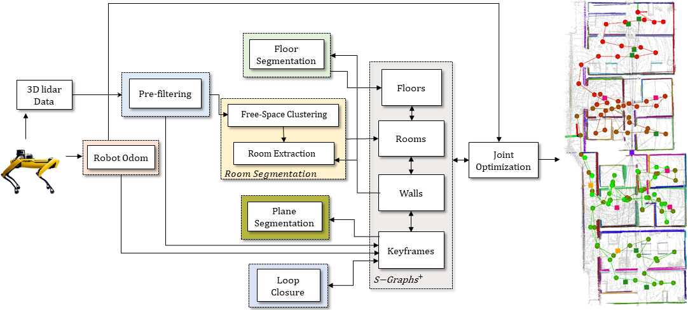

# S-Graphs

**Situational graphs (S-Graphs)** is a ROS package for generating in real-time three-layered hierarchical factor graphs representing a scene graph including the lowest **_Robot Tracking Layer_** registring the robot poses, **_Metric-Semantic Layer_** which maps planar features and **_Topological Layer_** constraining the planar features using room/corridor factors. It also supports several graph constraints, such as GPS, IMU acceleration (gravity vector), IMU orientation (magnetic sensor). We have tested this package with Velodyne (VLP16) sensors in structured indoor environments. This work is a fork of [hdl_graph_slam](https://github.com/koide3/hdl_graph_slam)


## Table of contents

- [Published Papers](#published-papers)
- [Getting Started](#getting-started)
- [About S-Graphs](#about-s-graphs)
  - [Architecture](#architecture)
- [Example on Datasets](#example-on-datasets)
  - [Real Dataset](#real-dataset)
  - [Virtual Dataset](#virtual-dataset)
- [ROS Related](#ros-related)
  - [Nodelets](#nodelets)
  - [Published TFs](#published-tfs)
  - [Services](#services)
  - [Parameters](#parameters)
- [License](#license)
- [Maintainers](#maintainers)

## Published Papers

1. [Situational Graphs for Robot Navigation in Structured Indoor Environments
   ](https://arxiv.org/abs/2202.12197)
   - **Citation**
     ```latex
     @misc{bavle2022situational,
           title={Situational Graphs for Robot Navigation in Structured Indoor Environments},
           author={Hriday Bavle and Jose Luis Sanchez-Lopez and Muhammad Shaheer and Javier Civera and Holger Voos},
           year={2022},
           eprint={2202.12197},
           archivePrefix={arXiv},
           primaryClass={cs.RO}
     }
     ```

## Getting started

1. Clone this repository

2. Pull the docker image from DockerHub

```sh
docker pull sntarg/s_graphs:latest
```

3. Create a container for the s_graphs image.

```sh
docker run -dit --net host --name s_graphs_container sntarg/s_graphs
```

This command also incorporates the flags `d`, which makes the container run in the detached mode and `net`, which gives the container the access of the host interfaces.

4. Execute the container

```sh
docker exec -ti s_graphs_container bash
```

5. Source the s_graphs workspace

```sh
source devel/setup.bash
```

## About S-Graphs

### Architecture



## Example on Datasets

**Note:** For each command below, please execute them in separate terminal windows!

### Download Datasets

[Real Dataset](https://uniluxembourg-my.sharepoint.com/:u:/g/personal/hriday_bavle_uni_lu/EQN2qUn1P1dKuzcZqan8o3UBrBMa8b5Pcspupm_CBFHTgA?e=JxYnAJ)

[Virtual Dataset](https://uniluxembourg-my.sharepoint.com/:u:/g/personal/hriday_bavle_uni_lu/EWy7dyDnGzFLh3LMR0VXYQABne9B_NZ0YCM-o_PF8PPY5g?e=xoThE1)

### Real Dataset

```bash
cd PATH_TO_THIS_REPO && rviz -d rviz/s_graphs.rviz
```

**The next command run it inside the docker container!**

```bash
roslaunch s_graphs s_graphs.launch use_free_space_graph:=true 2>/dev/null
```

```bash
rosbag PATH_TO_REAL_DATASET --clock
```

### Virtual Dataset

```bash
cd PATH_TO_THIS_REPO && rviz -d rviz/s_graphs.rviz
```

**The next command run it inside the docker container!**

```bash
roslaunch s_graphs s_graphs.launch use_free_space_graph:=true env:=virtual 2>/dev/null
```

```bash
rosbag play PATH_TO_VIRTUAL_DATASET --clock
```

## ROS Related

### Nodelets

> s_graphs is composed of **3** main nodelets.

- **s_graphs_nodelet**

  - Subscribed Topics

    - `/odom` ([nav_msgs/Odometry](http://docs.ros.org/en/noetic/api/nav_msgs/html/msg/Odometry.html))
      - The odometry from the robot.
    - `/filtered_points` ([sensor_msgs/PointCloud2](http://docs.ros.org/en/melodic/api/sensor_msgs/html/msg/PointCloud2.html))
      - The data from the Lidar sensor.

  - Published Topics

    - `/s_graphs/markers` ([visualization_msgs/MarkerArray](http://docs.ros.org/en/noetic/api/visualization_msgs/html/msg/MarkerArray.html))
      - The markers represents the different s_graphs layers.
    - `/s_graphs/odom2map` ([geometry_msgs/TransformStamped](http://docs.ros.org/en/api/geometry_msgs/html/msg/TransformStamped.html))
      - Sets where the robot pose is within the map (world).
    - `/s_graphs/odom_pose_corrected` ([geometry_msgs/PoseStamped](http://docs.ros.org/en/noetic/api/geometry_msgs/html/msg/PoseStamped.html))
      - The pose of the robot once odom2map is applied.
    - `/s_graphs/odom_path_corrected` ([nav_msgs/Path](http://docs.ros.org/en/noetic/api/nav_msgs/html/msg/Path.html))

      - The path of the robot once the odom2map is applied.

    - `/s_graphs/map_points` ([sensor_msgs/PointCloud2](http://docs.ros.org/en/melodic/api/sensor_msgs/html/msg/PointCloud2.html))
      - The points that represent the first layer of S-Graphs.
    - `/s_graphs/map_planes` (s_graphs/PlanesData)
      - Current planes seen by the robot.
    - `/s_graphs/all_map_planes` (s_graphs/PlanesData)
      - All the planes that were seen by the robot.

- **room_segmentation_nodelet**

  - Subscribed Topics

    - `/voxblox_skeletonizer/sparse_graph` ([visualization_msgs/MarkerArray](http://docs.ros.org/en/noetic/api/visualization_msgs/html/msg/MarkerArray.html))
      - Represents the free space where the robot can go to. This is also knonw as free-space clusters.
    - `/s_graphs/map_planes` (s_graphs/PlanesData)
      - Current planes seen by the robot.

  - Published Topics

    - `/room_segmentation/room_data` (s_graphs/RoomsData)
      - Contains all the necessary information about the rooms in a floor.

- **floor_plane_nodelet**

  - Subscribed Topics

    - `/s_graphs/all_map_planes` (s_graphs/PlanesData)
      - All the planes that were seen by the robot.

  - Published Topics

    - `/floor_plan/floor_data` (s_graphs/RoomData):
      - Constains all the necessary information about each floor.

### Services

- `/s_graphs/dump` (s_graphs/DumpGraph)

  - save all the internal data (point clouds, floor coeffs, odoms, and pose graph) to a directory.

- `/s_graphs/save_map` (s_graphs/SaveMap)
  - save the generated map as a PCD file.

### Parameters

All the configurable parameters are listed in _launch/s_graphs.launch_ as ros params.

### Published TFs

- `map2odom`: The transform published between the map frame and the odom frame after the corrections have been applied.


## License

This package is released under the **BSD-2-Clause** License.

Note that the cholmod solver in g2o is licensed under GPL. You may need to build g2o without cholmod dependency to avoid the GPL.

## Maintainers

- <ins>**Hriday Bavle**</ins>
  - **Email:** hriday.bavle@uni.lu
  - **Website:** https://www.hriday.bavle.com/
- <ins>**Muhammad Shaheer**</ins>
  - **Email:** muhamad.shaheer@uni.lu
- <ins>**Pedro Soares**</ins>
  - **Email:** pedro.soares@uni.lu
