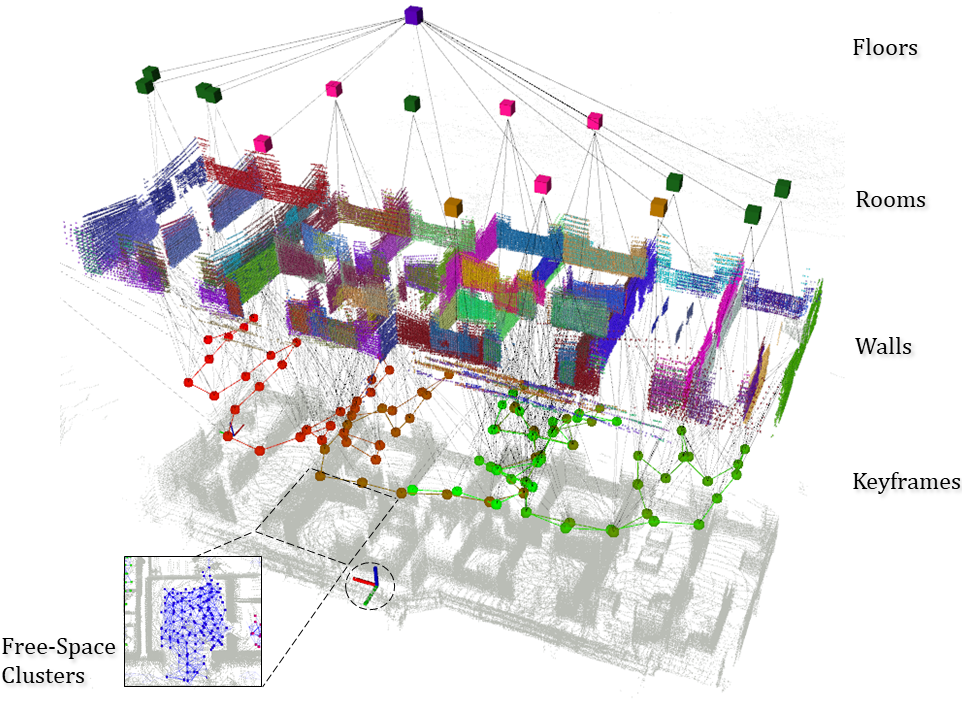
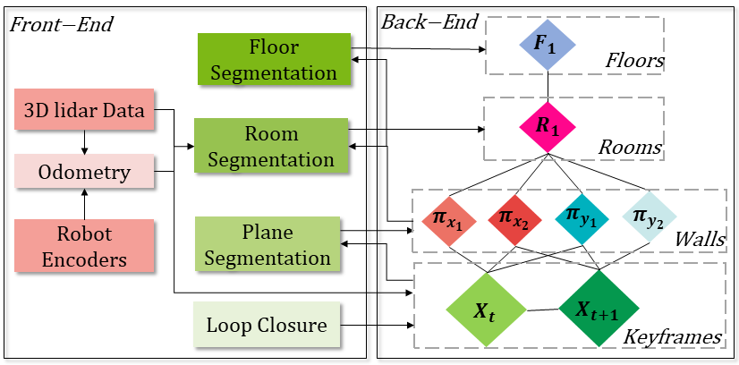
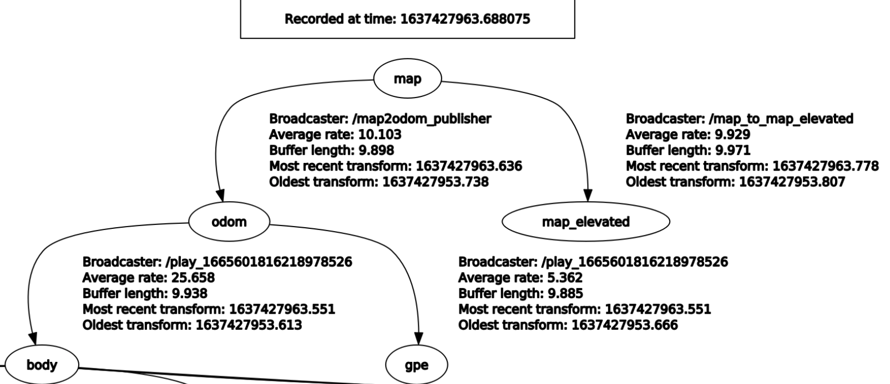

<p align="center">
  <h1 align="center">S-Graphs+: Real-time Localization and Mapping leveraging Hierarchical Representations</h1>
    <p align="center">
    <a href="http://hriday.bavle.com/"><light>Hriday Bavle</light></a>
    ·
    <a href="https://wwwen.uni.lu/snt/people/jose_luis_sanchez_lopez"><light>Jose Luis Sanchez-Lopez</light></a>
    <br>
    <a href="https://wwwen.uni.lu/snt/people/muhammad_shaheer"><light>Muhammad Shaheer</light></a>
    ·
    <a href="https://scholar.google.com/citations?user=j_sMzokAAAAJ&hl=en"><light>Javier Civera</light></a>
    ·
    <a href="https://wwwen.uni.lu/studies/fstm/interdisciplinary_space_master/holger_voos"><light>Holger Voos</light></a>
  </p>

  <h3 align="center"><a href="https://arxiv.org/pdf/2212.11770.pdf">Paper</a> | <a href="https://www.youtube.com/watch?v=p8vLZqaV_70">Video</a></h3>
  
</p>

<br>

<p align="center">
  <a href="">
    
  </a>
</p>

<!-- TABLE OF CONTENTS -->
<details open="open" style='padding: 10px; border-radius:5px 30px 30px 5px; border-style: solid; border-width: 1px;'>
  <summary>Table of Contents</summary>
  <ol>
    <li>
      <a href="#about-s-graphs">About S-Graphs</a>
      <ul>
        <li>
          <a href="#architecture">Architecture</a>
        </li>
      </ul>
    </li>
    <li>
      <a href="#getting-started">Getting Started</a>
    </li>
    <li>
      <a href="#example-on-datasets">Example on Datasets</a>
      <ul>
        <li>
          <a href="#real-dataset">Real Dataset</a>
        </li>
        <li>
          <a href="#virtual-dataset">Virtual Dataset</a>
        </li>
      </ul>
    </li>
    <li>
      <a href="#ros-related">ROS Related</a>
        <ul>
        <li>
          <a href="#nodelets">Nodelets</a>
        </li>
        <li>
          <a href="#published-tfs">Published TFs</a>
        </li>
        <li>
          <a href="#services">Services</a>
        </li>
        <li>
          <a href="#parameters">Parameters</a>
        </li>
      </ul>
    </li>
    <li>
      <a href="#license">License</a>
    </li>
    <li>
      <a href="#maintainers">Maintainers</a>
    </li>
  </ol>
</details>

## Published Papers

1. [S-Graphs+: Real-time Localization and Mapping leveraging
Hierarchical Representations
   ](https://arxiv.org/abs/2212.11770)
   - **Citation**
     ```latex
      @misc{bavle2022sgraphs+,
        title = {S-Graphs+: Real-time Localization and Mapping leveraging Hierarchical Representations},
        author={Hriday Bavle and Jose Luis Sanchez-Lopez and Muhammad Shaheer and Javier Civera and Holger Voos},
        year={2022},
        publisher = {arXiv},
        year = {2022},
        primaryClass={cs.RO}
     }
     ``` 

2. [Situational Graphs for Robot Navigation in Structured Indoor Environments
   ](https://arxiv.org/abs/2202.12197)
   - **Citation**
     ```latex
      @ARTICLE{9826367,
        author={Bavle, Hriday and Sanchez-Lopez, Jose Luis and Shaheer, Muhammad and Civera, Javier and Voos, Holger},
        journal={IEEE Robotics and Automation Letters}, 
        title={Situational Graphs for Robot Navigation in Structured Indoor Environments}, 
        year={2022},
        volume={7},
        number={4},
        pages={9107-9114},
        doi={10.1109/LRA.2022.3189785}}
     ```

## Getting started

1. Clone this repository

2. Pull the docker image from DockerHub

```sh
docker pull sntarg/s_graphs:latest
```

3. Create a container for the s_graphs image.

```sh
docker run -dit --net host --name s_graphs_container sntarg/s_graphs
```

This command also incorporates the flags `d`, which makes the container run in the detached mode and `net`, which gives the container the access of the host interfaces.

4. Execute the container

```sh
docker exec -ti s_graphs_container bash
```

5. Source the s_graphs workspace

```sh
source devel/setup.bash
```

## About S-Graphs

### Architecture

<p align="center">
<a href="">

</a>
</p>

## Example on Datasets

**Note:** For each command below, please execute them in separate terminal windows!

### Download Datasets

[Real Dataset](https://uniluxembourg-my.sharepoint.com/:u:/g/personal/hriday_bavle_uni_lu/EQN2qUn1P1dKuzcZqan8o3UBrBMa8b5Pcspupm_CBFHTgA?e=JxYnAJ)

[Virtual Dataset](https://uniluxembourg-my.sharepoint.com/:u:/g/personal/hriday_bavle_uni_lu/EWy7dyDnGzFLh3LMR0VXYQABne9B_NZ0YCM-o_PF8PPY5g?e=xoThE1)

### Real Dataset

```bash
cd PATH_TO_THIS_REPO && rviz -d rviz/s_graphs.rviz
```

**The next command run it inside the docker container!**

```bash
roslaunch s_graphs s_graphs.launch env:=real use_free_space_graph:=true 2>/dev/null
```

```bash
rosbag PATH_TO_THIS_REPO/real_dataset --clock
```

### Virtual Dataset

```bash
cd PATH_TO_THIS_REPO && rviz -d rviz/s_graphs.rviz
```

**The next command run it inside the docker container!**

```bash
roslaunch s_graphs s_graphs.launch env:=virtual use_free_space_graph:=true 2>/dev/null
```

```bash
rosbag play PATH_TO_THIS_REPO/virtual_dataset --clock
```

### Dataset only using a Velodyne

```bash
roscd s_graphs && rviz -d rviz/s_graphs.rviz
```

```bash
roslaunch s_graphs s_graphs.launch use_free_space_graph:=true compute_odom:=true 2>/dev/null
```

```bash
rosbag play PATH_TO_ROSBAG_DATASET --clock
```

## ROS Related

### Nodelets

> s_graphs is composed of **3** main nodelets.

- **s_graphs_nodelet**

  - Subscribed Topics

    - `/odom` ([nav_msgs/Odometry](http://docs.ros.org/en/noetic/api/nav_msgs/html/msg/Odometry.html))
      - The odometry from the robot.
    - `/filtered_points` ([sensor_msgs/PointCloud2](http://docs.ros.org/en/melodic/api/sensor_msgs/html/msg/PointCloud2.html))
      - The data from the Lidar sensor.

  - Published Topics

    - `/s_graphs/markers` ([visualization_msgs/MarkerArray](http://docs.ros.org/en/noetic/api/visualization_msgs/html/msg/MarkerArray.html))
      - The markers represents the different s_graphs layers.
    - `/s_graphs/odom2map` ([geometry_msgs/TransformStamped](http://docs.ros.org/en/api/geometry_msgs/html/msg/TransformStamped.html))
      - Sets where the robot pose is within the map (world).
    - `/s_graphs/odom_pose_corrected` ([geometry_msgs/PoseStamped](http://docs.ros.org/en/noetic/api/geometry_msgs/html/msg/PoseStamped.html))
      - The pose of the robot once odom2map is applied.
    - `/s_graphs/odom_path_corrected` ([nav_msgs/Path](http://docs.ros.org/en/noetic/api/nav_msgs/html/msg/Path.html))

      - The path of the robot once the odom2map is applied.

    - `/s_graphs/map_points` ([sensor_msgs/PointCloud2](http://docs.ros.org/en/melodic/api/sensor_msgs/html/msg/PointCloud2.html))
      - The points that represent the first layer of S-Graphs.
    - `/s_graphs/map_planes` (s_graphs/PlanesData)
      - Current planes seen by the robot.
    - `/s_graphs/all_map_planes` (s_graphs/PlanesData)
      - All the planes that were seen by the robot.

- **room_segmentation_nodelet**

  - Subscribed Topics

    - `/voxblox_skeletonizer/sparse_graph` ([visualization_msgs/MarkerArray](http://docs.ros.org/en/noetic/api/visualization_msgs/html/msg/MarkerArray.html))
      - Represents the free space where the robot can go to. This is also knonw as free-space clusters.
    - `/s_graphs/map_planes` (s_graphs/PlanesData)
      - Current planes seen by the robot.

  - Published Topics

    - `/room_segmentation/room_data` (s_graphs/RoomsData)
      - Contains all the necessary information about the rooms in a floor.

- **floor_plane_nodelet**

  - Subscribed Topics

    - `/s_graphs/all_map_planes` (s_graphs/PlanesData)
      - All the planes that were seen by the robot.

  - Published Topics

    - `/floor_plan/floor_data` (s_graphs/RoomData):
      - Constains all the necessary information about each floor.

### Services

- `/s_graphs/dump` (s_graphs/DumpGraph)

  - save all the internal data (point clouds, floor coeffs, odoms, and pose graph) to a directory.

- `/s_graphs/save_map` (s_graphs/SaveMap)
  - save the generated map as a PCD file.

### Parameters

All the configurable parameters are listed in _launch/s_graphs.launch_ as ros params.

### Published TFs

- `map2odom`: The transform published between the map frame and the odom frame after the corrections have been applied.

<p align="center">
<a href="">

</a>
</p>

## Instructions To Use S-Graphs

1. Define the transformation between your sensors (LIDAR, IMU, GPS) and base_link of your system using static_transform_publisher (see line #94, s_graphs.launch). All the sensor data will be transformed into the common `base_link` frame, and then fed to the SLAM algorithm. Note: `base_link` frame in virtual dataset is set to `base_footprint` and in real dataset is set to `body` 

2. Remap the point cloud topic of **_PrefilteringNodelet_**. Like:

```xml
  <node pkg="nodelet" type="nodelet" name="hdl_prefilter" args="load s_graphs/PrefilteringNodelet hdl_prefilter_nodelet_manager">
    <remap from="/velodyne_points" to="/rslidar_points"/>
  ...
```

3. If you have an odometry source convert it to base ENU frame, then remove the **_ScanMatchingNodelet_** from line #37 to #50 in `s_graphs.launch` and then remap odom topic in **_SGraphsNodelet_** like 

```xml
  <node pkg="nodelet" type="nodelet" name="s_graphs" args="load s_graphs/SGraphsNodelet s_graphs_nodelet_manager" output="screen"> 
    <remap if="$(eval arg('env') == 'real')" from="/odom" to="/platform/odometry" />
  ...
```
Note: If you want to visualize the tfs correctly then your odom source must provide a tf from the `odom` to `base_link` frame.  

## License

This package is released under the **BSD-2-Clause** License.

Note that the cholmod solver in g2o is licensed under GPL. You may need to build g2o without cholmod dependency to avoid the GPL.

## Maintainers

- <ins>**Hriday Bavle**</ins>
  - **Email:** hriday.bavle@uni.lu
  - **Website:** https://www.hriday.bavle.com/
- <ins>**Muhammad Shaheer**</ins>
  - **Email:** muhamad.shaheer@uni.lu
- <ins>**Pedro Soares**</ins>
  - **Email:** pedro.soares@uni.lu
  
## Webpage
- <ins>**Maria Zhekova**</ins>
 - **Email:** mzhekova97@gmail.com
  
